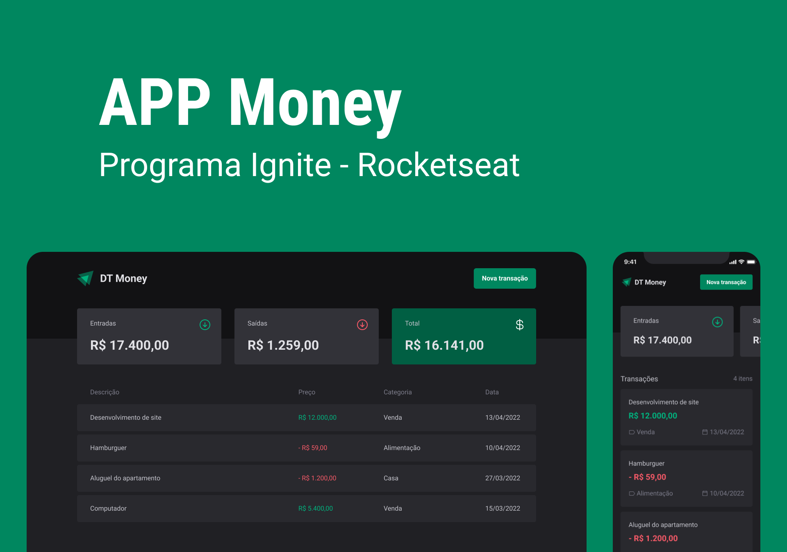
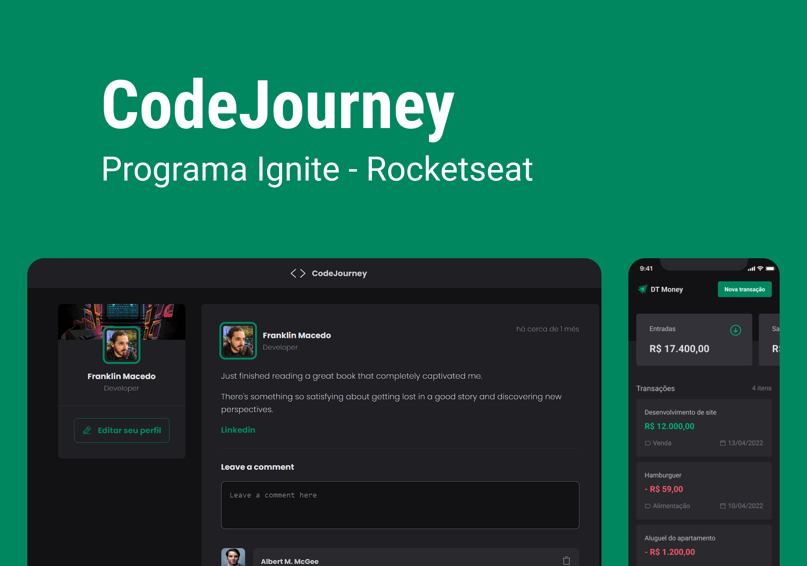
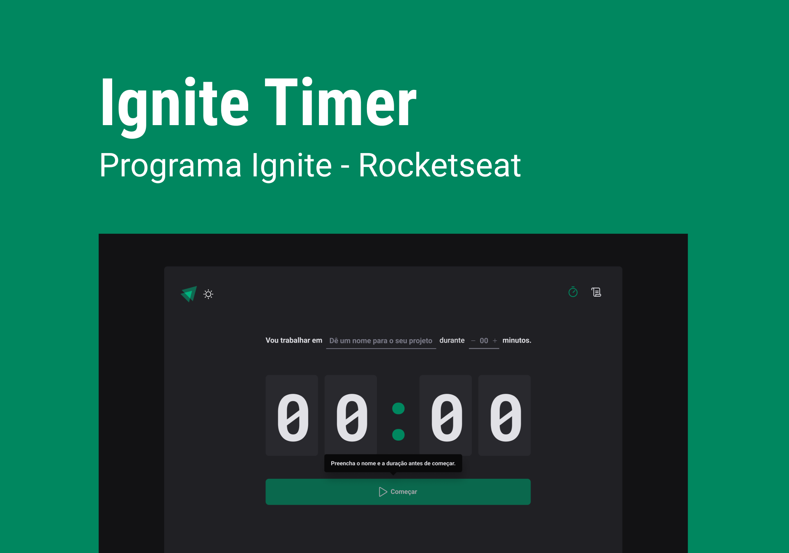

<h1 align="center"> React Dev Journey </h1>

Learning React was a turning point for me. I confess it was challenging, and I had many doubts at the beginning, especially about where to start. Through extensive research and studies in the documentation, I embarked on some initial projects, and luckily, I ended up joining the Rocketseat community, where I gained access to their Ignite course, allowing me to learn significantly through practical projects.

Throughout the classes with Diego, CEO of Rocketseat, I acquired valuable knowledge and tips.

During this learning journey, I had the opportunity to work on a variety of projects covering different areas and skills. Over time, I built a significant portfolio that reflects my professional growth and acquired skills.

These experiences not only provided me with valuable learning but also allowed me to develop a holistic approach to handling projects, from the planning phase to the final delivery. By accumulating these projects, I am confident in my ability to face new challenges and contribute significantly to future initiatives.
 

  <a href="#-projeto">Project</a>&nbsp;&nbsp;&nbsp;|&nbsp;&nbsp;&nbsp;
  <a href="#-layout">Layout</a>&nbsp;&nbsp;&nbsp;|&nbsp;&nbsp;&nbsp;
  <a href="#memo-licença">Contact</a>

 

## 👨‍💻 Project

**App Money:**
In this project, a complete front-end web application was built, connecting to an API and how to perform applications with React, understanding how the library's internal algorithms and the entire component rendering flow work.

<a href="https://app-money-five.vercel.app" target="_blank">🚀 Live </a>

**React Fundamentals:**
A React application was built using Vite and I learned about the most important concepts of react, including componentization, properties, states, immutability and hooks, in addition to applying TypeScript to our project to add static typing to the application.

<a href="https://react-dev-journey.vercel.app" target="_blank">🚀 Live </a>

**Project Timer:**
In this project we built a complete application with routing and several important concepts from the React ecosystem such as ContextAPI, useReducer, immer, React Router, Hook Form.

<a href="https://project-timer-ten.vercel.app" target="_blank">🚀 Live </a>

## 👨‍💻 Layout

**App Money:**

  
  <a href="https://www.figma.com/community/file/1138814493269096792" target="_blank"><i>App Money</i></a>

**React Fundamentals:**

  
  <i>Code Journey</i>

**Project Timer:**

  
  <a href="https://www.figma.com/community/file/1138814493269096792" target="_blank"><i>Project Timer</i></a>

 

## 🙋Contact

 &nbsp;&nbsp;&nbsp;|&nbsp;&nbsp;&nbsp;

